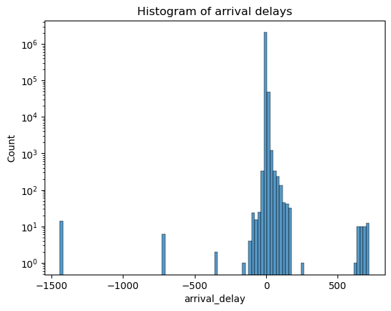

# Project of Data Visualization (COM-480)

| Student's name | SCIPER |
| -------------- | ------ |
| Ozan Arda Guven| 297076|
| Arnaud Poletto| 302411|
| Defne Culha| 353020|

[Milestone 1](#milestone-1) • [Milestone 2](#milestone-2) • [Milestone 3](#milestone-3)

## Milestone 1 (23rd April, 5pm)

**10% of the final grade**

This is a preliminary milestone to let you set up goals for your final project and assess the feasibility of your ideas.
Please, fill the following sections about your project.

*(max. 2000 characters per section)*

### Dataset

> Find a dataset (or multiple) that you will explore. Assess the quality of the data it contains and how much preprocessing / data-cleaning it will require before tackling visualization. We recommend using a standard dataset as this course is not about scraping nor data processing.
>
> Hint: some good pointers for finding quality publicly available datasets ([Google dataset search](https://datasetsearch.research.google.com/), [Kaggle](https://www.kaggle.com/datasets), [OpenSwissData](https://opendata.swiss/en/), [SNAP](https://snap.stanford.edu/data/) and [FiveThirtyEight](https://data.fivethirtyeight.com/)), you could use also the DataSets proposed by the ENAC (see the Announcements section on Zulip).
>
> We will use multiple datasets for our website.
> 
> #### Main SBB dataset: 
> The [Open data platform mobility Switzerland](https://opentransportdata.swiss/en/dataset) provides access to a variety of datasets related to Swiss Federal Railways, including the SBB Swiss train dataset. To examine the quality of the SBB Swiss train dataset we followed some steps.To check the completeness of the dataset, we look if it includes all the trains, stations, and routes that we wanted to visualize and see if there are any missing values. To check the consistency of the dataset, we examine the station names, train numbers, and times. They seem to be at a consistent format and data type for a given week. Lastly, to check the accuracy of the dataset, we check if the times recorded correctly on the dataset match with the current SBB app time schedules. It is indeed correct for most values.
For preprocessing/cleaning required for visualization we first translate the names from German into English so they are easier to understand for us. We convert the time data to a consistent format so that it can be easily plotted in a visualization tool. Next, we handle any missing or inconsistent data points by either imputing values or removing them altogether. Moreover, since the database is quite large, we reduce the data to a level that is appropriate for our visualization and we organize it. We also analyse outliers and any samples that seem odd.

> #### BAV list dataset
> [This dataset](https://opentransportdata.swiss/en/dataset/bav_liste) contains the list of station and stop names. By using the BAV list to fill in missing data for the stop_name attribute in a dataset, we can improve the accuracy and completeness of the dataset. It also contains the geographic coordinates, which might be useful for later.

> #### Switzerland maps dataset
> Moreover, to visualise this dataset on maps, we use a [maps database](https://labs.karavia.ch/swiss-boundaries-geojson/) sourced from Swiss Federal Office of Topography. It can be found here and it provides geojson files of Switzerland maps, divided by cities, cantons, regions and more. 

### Problematic
> In this section, we frame the general topic of our visualization and the main axis that we want to develop.
> #### What are we trying to show with our visualization?
> We would like to create visualizations that provide insight into train schedules, delays, and other aspects of Swiss railway operations. We would like to visualise cancellations and delays and analyse them with time for different lines, different train operators operating in Switzerland (like SBB, Trenitalia, DB, SNCF) as well as business of different lines.
> 
> #### Overview for the project, motivation, and the target audience.
> Map-based visualizations of the SBB Swiss train dataset could be used to explore the evolution of train schedules, routes, and passenger traffic over time and places. The target audience of such a website could be railway enthusiasts or the general public. Our design could be useful to gain insights into the reliability and punctuality of Swiss trains, or to explore the popularity of different train stations and routes. This can further help people to plan their travels or to satisfy their curiosity about Swiss railway operations. 

### Exploratory Data Analysis

#### Pre-processing of the data set you chose
> We performed the following preprocessing tasks (see more [in this notebook](preprocessing.ipynb)):
> - __Data completeness:__ Analyzed each column and identified and explained possible values for categories.
> - __Data cleaning:__ Analyzed each column and identified possible values.
> - __Time data conversion:__ Analyzed each column and identified possible values.
> - __Data translation:__ Translated from German to English for better understanding and consistency.
> - __Preprocessing pipeline:__ Developed a pipeline that to process other days' data.
> - __Removing unnecessary columns:__ We removed any columns that were not relevant to our analysis, streamlining the dataset and making it more focused on the variables of interest.
> - __Data compression:__ Compressed dataset by using more compact data types and converting it to the Parquet file format.

> Here is a list of each important field in the chosen dataset:
> - __date:__ Date of the journey.
> - __trip_id:__ Identifier of the journey.
> - __operator_id:__ Identifier of the operator. (Chemins de fer du Jura, Bus Sierrois)
> - __operator_abbreviation:__ Abbreviation of the operator.
> - __operator_name:__ Name of the operator.
> - __product_id:__ Identifier of the product.
> - __line_text:__ Name of the line. (S9, IR15)
> - __transport_type:__ Type of transport. (Train, Tram, Bus, …)
> - __is_additional_trip:__ Whether the journey is an additional one.
> - __is_cancelled:__ Whether the journey is cancelled.
> - __stop_id:__ Identifier of the stop.
> - __stop_name:__ Name of the stop.
> - __arrival_time:__ Arrival time at the stop.
> - __arrival_forecast:__ Arrival time at the stop (predicted).
> - __arrival_forecast_status:__ Status of the predicted arrival time.
> - __departure_time:__ Departure time from the stop.
> - __departure_forecast:__ Departure time from the stop (predicted).
> - __departure_forecast_status:__ Status of the predicted departure time.
> - __is_through_trip:__ Whether the stop is a through stop.

#### Basic statistics and insights about the data

> We plot some histograms corresponding to the delays in minutes for each arrival of each line to present some statistics and insights about the data.
>
> 
> 
> 
> 
> 
> 
> 
> 
> 
> 
> 
> 

### Related work

> #### What others have already done with the data
> This database has been used before for academic, professional and personal reasons. There are many mobile apps and websites who use this dataset to provide real-time train information and schedules, including the SBB Mobile App and Swiss Timetable App. As it can be found on [this webpage](https://opentransportdata.swiss/de/showcase-5/), many people have used this dataset for their own visualization projects apps as well. Many research papers also feature this dataset, for studies on predicting train delays, analyzing passenger behavior, and optimizing train schedules. For example, one study uses the dataset to develop a machine learning model for predicting train delays based on historical data. 
> 
> #### Why is our approach original?
> We would like to create visualizations that provide insight into train schedules, delays, and other aspects of Swiss railway operations. If we can, we would like to integrate isochronic map and provide a more comprehensible visualization than it has ever been done by using techniques we learn in the lectures on this dataset. 
> 
> #### Our inspirations
> We take inspiration from a project called [Isochronic France](https://www.youtube.com/watch?app=desktop&v=bGyfuSlYWa0&embeds_euri=https%3A%2F%2Fsenseable.mit.edu%2F&source_ve_path=MTM5MTE3&feature=emb_logo) which has been developed by MIT Senseable City Lab in collaboration with SNCF. In this visualization, representations are proportional to travel time and reveal the changes in the course of a one week period. Users can select any one of the presented locations as their origin to explore what cities can be reached within specific travel times. The interface allows users to access the information for a specific time or visualize this information over the course of a week.
> Furthermore, we take inspiration from [Trains in Time](https://www.youtube.com/watch?v=I17_nuPiJI4&t=3s) which is a project developed by the same Lab. This combines data on the time trains run behind schedule with the actual number of passengers on any train at any moment. This information is represented at the actual location of a train on SNCF's high speed rail network. 
> 
> #### In case you are using a dataset that you have already explored in another context (ML or ADA course, semester project...), you are required to share the report of that work to outline the differences with the submission for this class.
> Defne uses the same dataset in the COM-490: Large Scale Data Science course. We use it to learn how to use LSDS tools such as HDFS, Hive, HBase, SQL and more. It’s a course with a different objective but she will be sure to report differences between this project and that course.

## Milestone 2 (7th May, 5pm)

**10% of the final grade**

## Milestone 3 (4th June, 5pm)

**80% of the final grade**

## Late policy

- < 24h: 80% of the grade for the milestone
- < 48h: 70% of the grade for the milestone

