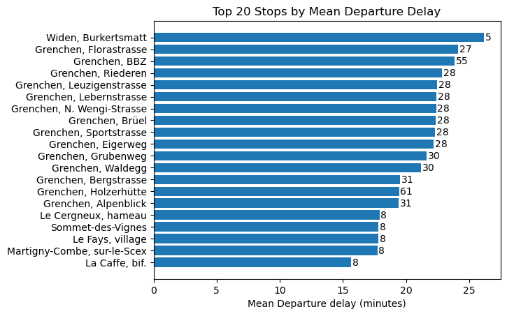

# **Project of Data Visualization (COM-480)**

| Student's name | SCIPER |
| -------------- | ------ |
| Ozan Arda Güven| 297076|
| Arnaud Poletto| 302411|
| Defne Culha| 353020|

[Milestone 1](#milestone-1) • [Milestone 2](#milestone-2) • [Milestone 3](#milestone-3)

## **Description**

- [📁 data](data) contains raw and processed data.
  - [📁 networks](data/networks) contains Gephi files of networks with their respective node and edge files, along with more detailed files for the website's network visualization.
  - [📁 processed](data/processed) contains processed data.
    - [📄 operators.csv](data/processed/operators.csv) contains the list of operators.
    - [📄 stops.csv](data/processed/stops.csv) contains the list of stops.
    - [🔒 transports.parquet](data/processed/transports.parquet) contains the processed entries of the whole year of 2022.
    - [🔒 transports_v2.parquet](data/processed/transports_v2.parquet) contains the processed entries of the whole year of 2022, **further processed and filtered to create the network visualization**.
    - [🔒 trains_v2.parquet](data/processed/trains_v2.parquet) contains the processed entries of **trains only** of the whole year of 2022, further processed and filtered to create the network visualization.
  - [📄 bav_list_current_timetable.xlsx](data/bav_list_current_timetable.xlsx) contains the list of stations and stops and many informative columns.
- [📁 generated](generated) contains generated images and charts.
- [📁 notebooks](notebooks) contains notebooks used for data analysis and visualization.
  - [📁 preprocessing](notebooks/data_processing) contains notebooks used for data processing.
  - [📁 analysis](notebooks/analysis) contains notebooks used for data analysis.
- [📁 src](src) contains source code for the notebook extension.
- [📁 spark](spark) contains the spark project used to process the data when basic python processing was not enough.
- [📁 network_example](network_example) contains the website with the network implementation.
- [📁 map_example_1](map_example_1) contains the website with the map implementation using D3.js, rendered with SVG.
- [📁 map_example_2](map_example_2) contains the website with the map implementation using D3.js and Three.js, rendered with WebGL.

## **Milestone 1**

### **Dataset**

#### **Actual Data from Open Data Platform Mobility Switzerland**
The [Open Data Platform Mobility Switzerland](https://opentransportdata.swiss/en/dataset) is a digital platform that provides open and standardized data related to mobility in Switzerland. We are mainly interested in the [Actual Data](https://opentransportdata.swiss/en/cookbook/actual-data/) dataset that contains real-time information about the Swiss public transport system, including schedules for trains, buses, trams… along with their delays, cancellations, transport operators. The data is available on a per-day basis.

Here is a list of each important field in this dataset, presented as a table:
 
| Field                     | Description                                                           |
| -----------------------   | --------------------------------------------------------------------  |
| date                      | Date of the journey.                                                  |
| trip_id                   | Identifier of the journey.                                            |
| operator_id               | Identifier of the operator. (Chemins de fer du Jura, Bus Sierrois)    |
| operator_abbreviation     | Abbreviation of the operator.                                         |
| operator_name             | Name of the operator.                                                 |
| product_id                | Identifier of the product.                                            |
| line_text                 | Name of the line. (S9, IR15)                                          |
| transport_type            | Type of transport. (Train, Tram, Bus, …)                              |
| is_additional_trip        | Whether the journey is an additional one.                             |
| is_cancelled              | Whether the journey is cancelled.                                     |
| stop_id                   | Identifier of the stop.                                               |
| stop_name                 | Name of the stop.                                                     |
| arrival_time              | Arrival time at the stop.                                             |
| arrival_forecast          | Arrival time at the stop (predicted).                                 |
| arrival_forecast_status   | Status of the predicted arrival time.                                 |
| departure_time            | Departure time from the stop.                                         |
| departure_forecast        | Departure time from the stop (predicted).                             |
| departure_forecast_status | Status of the predicted departure time.                               |
| is_through_trip           | Whether the stop is a through stop.     

#### **Federal Office of Transport's list of stations and stops**
The [Federal Office of Transport's list of stations and stops](https://opentransportdata.swiss/en/dataset/bav_liste) contains a comprehensive list of station and stop names. By using this dataset to fill in missing data for the stop_name attribute in our original dataset, we can improve the accuracy and completeness of the dataset. The geographic coordinates included in this dataset will be valuable for creating map-based visualizations and analyzing spatial patterns in the Swiss transport system.

#### **Switzerland maps dataset**
The [Switzerland Maps Dataset](https://labs.karavia.ch/swiss-boundaries-geojson/), sourced from the [Swiss Federal Office of Topography](https://shop.swisstopo.admin.ch/en/products/landscape/boundaries3D), offers high-resolution geojson files for various administrative divisions, including cities, cantons, and regions. It can be integrated with D3.js to develop engaging and interactive maps of Swiss administrative divisions.

### **Problematic**
In this project, we aim to develop an interactive, map-based visualization platform to provide valuable insights into Swiss transportation operations, covering not only trains but also other modes of transport like buses or trams. By exploring train schedules, routes, delays, and passenger traffic, we seek to offer a comprehensive understanding of the Swiss transportation system across locations. Our target audience encompasses railway enthusiasts, the general public, travelers who rely on various transportation options, and those looking to make more informed commuting decisions.

The platform will have several objectives:

1. Enhance the users' understanding of the reliability and punctuality of Swiss trains and other transportation modes by visualizing recent delay data.
2. Showcase the popularity of various stations and routes for different transport modes, allowing users to explore trends in passenger traffic and identify busy or less-frequented areas.
3. Provide a user-friendly interface for exploring schedules and gaining a comprehensive view of the Swiss transportation landscape.
4. Incorporate an isochronic map that showcases the connectivity and organization of Switzerland through its various means of transportation. This map will illustrate the estimated travel times from any given location to other destinations across the country, allowing users to understand the accessibility of different regions and make informed travel decisions.

By implementing these objectives, we aim to create a platform that empowers users with a deeper understanding of Switzerland's transportation network.

### **Exploratory Data Analysis**

#### **Pre-processing of the dataset you chose**
We performed the following preprocessing tasks (see more 📓 [in this notebook](notebooks/preprocessing/preprocessing_one_day.ipynb)):

- **Data completeness**: We analyzed each column in the dataset and identified possible values for each category. This helped us assess the completeness of the data and identify any missing values.
- **Data cleaning**: We fixed missing values and removed dirty entries to ensure that the dataset is clean and suitable for analysis. We corrected inconsistencies, such as arrival times recorded after departure times at the same stop.
- **Preprocessing pipeline**: We developed a preprocessing pipeline that can be applied to other days' data, making it easy to analyze and visualize multiple days' information.
- **Data translation**: We translated some values from German to English for better understanding and consistency across the dataset.
- **Removing unnecessary columns**: We removed any columns that were not relevant to our analysis, streamlining the dataset and making it more focused on the variables of interest.
- **Data compression**: To optimize our dataset, we compressed it by selecting certain fields as categories, using suitable data types, and converting it to the Parquet file format for better performance and storage efficiency.

#### **Basic statistics and insights about the data**

We performed some basic analysis on the processed dataset (see more 📓 [in this notebook](notebooks/analysis/basic_analysis_one_day.ipynb)):

  

The above graph highlights the popularity of buses, which can be attributed to their extensive coverage, flexibility, and cost-effectiveness. Trains follow as the next most popular mode. Trams and metro systems cater to urban commuters, while rack railways serve passengers in mountainous areas. This diverse range of transport options ensures a comprehensive public transportation network in Switzerland.

  

The above graph shows that trains are divided in $16$ different transport types each having significantly different number of entries.

  
  

The asymmetric distribution in the late train histogram can be attributed to efforts by train operators to minimize delays and the natural limit on early arrivals. On the right side, unpredictable factors such as equipment malfunctions, weather disruptions, and human errors can result in a wider spread of delays.

These graphs below show the top 10 operators regarding the delay the arrival and departure of their transport.

  
  

 

  

The graph above shows that the busiest stop is _Bern, Bahnhof_, followed by _Genève, gare Cornavin_.

  

  

From the graphs above, we can clearly see the peak hours in the graph above. The peak hours are $6:00$ to $8:00$ and $16:00$ to $18:00$. The rack railway is more consistent throughout the day.

  
  

These graphs above show the mean delay for each stop, with the number of entries taken into account for each stop. _Champoussin_ was not lucky that day, with a mean arrival delay of about $80$ minutes.

### **Related work**

#### **What others have already done with the data**

This database has been used before for academic, professional and personal reasons. There are many mobile apps and websites who use this dataset to provide real-time train information and schedules, including the [SBB Mobile App](https://www.sbb.ch/fr/horaire/horaires-mobiles/mobile-cff.html) and [Swiss Timetable App](https://www.sbb.ch/en/timetable.html). As it can be found on [this webpage](https://opentransportdata.swiss/de/showcase-5/), many people have used this dataset for their own visualization projects apps as well. Many research papers also feature this dataset, for studies on predicting train delays, analyzing passenger behavior, and optimizing train schedules. For example, [one study](https://lean-gate.geo.uzh.ch/prod/typo3conf/ext/qfq/Classes/Api/download.php/mastersThesis/639) uses the dataset to develop a machine learning model for predicting train delays based on historical data. 

#### **Why is our approach original?**

We aim to create an innovative, interactive visualization platform that offers unique insights into Swiss transportation operations. Our approach is original because we integrate various modes of transport, such as trains, buses, and trams, to provide a comprehensive view of the Swiss transportation system. Additionally, we incorporate an isochronic map that illustrates the connectivity and accessibility of different regions in Switzerland, offering a more comprehensible visualization than has been previously achieved. By using techniques learned in our lectures, we strive to make our platform user-friendly and valuable for a diverse audience, including railway enthusiasts, the general public, and travelers.

#### **Our inspirations**

We take inspiration from a project called [Isochronic France](https://www.youtube.com/watch?app=desktop&v=bGyfuSlYWa0&embeds_euri=https%3A%2F%2Fsenseable.mit.edu%2F&source_ve_path=MTM5MTE3&feature=emb_logo) which has been developed by [MIT Senseable City Lab](https://senseable.mit.edu/) in collaboration with [SNCF](https://www.sncf.com/fr). In this visualization, representations are proportional to travel time and reveal the changes in the course of a one week period. Users can select any one of the presented locations as their origin to explore what cities can be reached within specific travel times. The interface allows users to access the information for a specific time or visualize this information over the course of a week.

Furthermore, we take inspiration from [Trains in Time](https://www.youtube.com/watch?v=I17_nuPiJI4&t=3s) which is a project developed by the same Lab. This combines data on the time trains run behind schedule with the actual number of passengers on any train at any moment. This information is represented at the actual location of a train on SNCF's high speed rail network. 

#### **In case you are using a dataset that you have already explored in another context (ML or ADA course, semester project...), you are required to share the report of that work to outline the differences with the submission for this class.**

Defne uses the same dataset in the COM-490: Large Scale Data Science course. We use it to learn how to use LSDS tools such as HDFS, Hive, HBase, SQL and more. It’s a course with a different objective but she will be sure to report differences between this project and that course.

## **Milestone 2**

**(7th May, 5pm) | 10% of the final grade**

### **Sketches**

TODO

### **Tools**

The website will consist of three main parts described as follows:

**Home Page**: The home page will introduce the website, the problem at hand, and offer a first glance at the data and basic analysis. We will use _HTML_, _CSS_, and _JavaScript_ to create the layout and style of the home page. For displaying initial data visualizations, we will use _D3.js_, a popular _JavaScript_ library for creating data-driven graphics. _D3.js_ will allow us to build custom visualizations that can adapt to various data types and update dynamically as needed.

**Network Visualization**: In this section, we will create a network visualization of transport stops using _Sigma.js_. _Sigma.js_ is a lightweight, open-source library that specializes in graph drawing and is optimized for handling large networks, making it an ideal choice for visualizing the transport stop network. Nodes in the network will represent transport stops, while edges will be weighted based on the number of transport trips between stops in 2022. _Sigma.js_ allows for easy interaction and manipulation of the graph, enabling users to explore the network structure and gain insights into Swiss transportation operations.

**Interactive Map**: For the third part of the website, we will use a combination of _Three.js_ and _D3.js_ to create an interactive map displaying various data visualizations related to Swiss transportation. _Three.js_ is a powerful library for creating graphic scenes in the browser using _WebGL_, which allows for efficient rendering of complex graphics. In contrast, _D3.js_ excels at processing and visualizing data, particularly for processing _GeoJSON_ files and managing map projections. The two libraries will work in tandem to present heatmaps, simulate trains moving in Switzerland on an average day, and create isochronic maps using color zones or map deformation. While _D3.js_ will handle data processing, _Three.js_ will be responsible for displaying the visualizations efficiently using _WebGL_.

### **Breakdown of Tasks**

TODO

### **Core Visualization**

TODO

## **Milestone 3**

**(4th June, 5pm) | 80% of the final grade**

## **Late policy**

- < 24h: 80% of the grade for the milestone
- < 48h: 70% of the grade for the milestone

